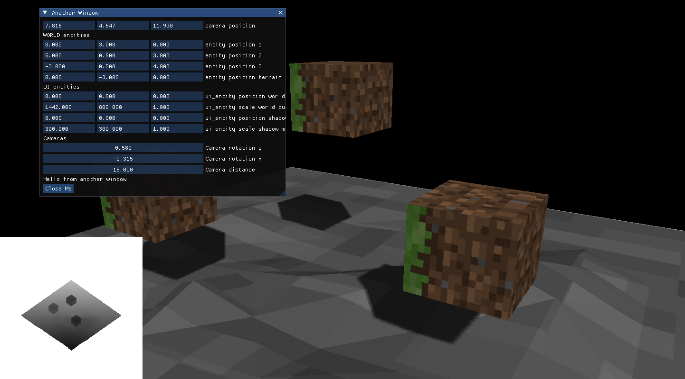

# RG2 - 3D OpenGL Renderer

RG2 is a modern 3D graphics renderer built with OpenGL, featuring shadow mapping, entity-component architecture, and real-time scene editing capabilities.



*RG2 in action: 3D scene with textured cubes, terrain mesh, real-time shadows, and ImGui debug interface*

## Features

- **Modern OpenGL Rendering Pipeline**: Uses OpenGL 4.6 Core Profile with GLAD loader
- **Shadow Mapping**: Real-time shadow rendering with PCF (Percentage Closer Filtering)
- **Entity-Component System**: Clean architecture with entities, meshes, cameras, and materials
- **3D Asset Loading**: Support for OBJ model files with MTL materials
- **Real-time UI**: ImGui integration for scene editing and debugging
- **Camera System**: Orbital camera with WASD controls
- **Texture Support**: PNG/JPG texture loading via STB libraries
- **Framebuffer Rendering**: Off-screen rendering for shadow maps and post-processing

## Dependencies

- **OpenGL 4.6+**: Core graphics API
- **GLFW**: Window management and input handling
- **GLAD**: OpenGL function loading
- **GLM**: Mathematics library for graphics
- **ImGui**: Immediate mode GUI for debugging
- **STB**: Image loading library
- **CMake**: Build system

## Project Structure

```
rg2/
├── src/                    # Source files
│   ├── main.cpp           # Application entry point
│   ├── Camera.cpp         # Camera implementation
│   ├── Entity.cpp         # Entity system
│   ├── Mesh.cpp           # Mesh geometry handling
│   ├── Shader.cpp         # Shader compilation and management
│   ├── Texture.cpp        # Texture loading and binding
│   ├── VAO.cpp            # Vertex Array Object wrapper
│   ├── VBO.cpp            # Vertex Buffer Object wrapper
│   ├── EBO.cpp            # Element Buffer Object wrapper
│   └── ObjLoader.cpp      # OBJ file parsing
├── include/               # Header files
├── shaders/               # GLSL shader files
│   ├── default.vert       # Main vertex shader
│   ├── default.frag       # Main fragment shader with lighting
│   ├── shadow_map.vert    # Shadow mapping vertex shader
│   ├── shadow_map.frag    # Shadow mapping fragment shader
│   ├── depth.vert         # Depth visualization vertex shader
│   ├── depth.frag         # Depth visualization fragment shader
│   ├── ui_default.vert    # UI rendering vertex shader
│   └── ui_default.frag    # UI rendering fragment shader
├── assets/                # 3D models and textures
│   ├── cube.obj           # Test cube model
│   ├── cube.mtl           # Cube material definition
│   ├── cube_tex.png       # Cube texture
│   ├── terrain.obj        # Terrain model
│   ├── terrain.mtl        # Terrain material
│   └── terrain.png        # Terrain texture
├── glfw/                  # GLFW library
├── glm/                   # GLM mathematics library
├── imgui/                 # ImGui library
├── stb/                   # STB libraries
└── CMakeLists.txt         # Build configuration
```

## Building

### Prerequisites

- C++17 compatible compiler (GCC, Clang, MSVC)
- CMake 3.1+
- OpenGL 4.6+ compatible graphics driver

### Build Steps

```bash
# Create build directory
mkdir build && cd build

# Configure project
cmake ..

# Build
make

# Run
./RG2
```

### Platform-Specific Setup

#### macOS
```bash
brew install glfw
```

#### Linux (Ubuntu/Debian)
```bash
sudo apt-get install libglfw3-dev libgl1-mesa-dev
```

#### Windows
Use vcpkg or manually install GLFW and OpenGL libraries.

### Known Build Issues

If you encounter OpenGL function errors during compilation, ensure all source files include the proper headers:
- `#include <glad/gl.h>` must come before any OpenGL calls
- `#include <stdexcept>` needed for exception handling

## Usage

### Controls

- **WASD**: Orbit camera around the scene
- **Mouse**: ImGui interface interaction
- **ESC**: Close application

### Scene Features

The application renders a 3D scene with:
- Multiple textured cube entities
- A terrain mesh
- Real-time shadow mapping from a directional light
- Interactive camera controls
- Debug UI for entity positioning and camera parameters

### ImGui Interface

The debug panel allows real-time editing of:
- Camera position and orientation
- Entity positions and scales
- Light parameters
- Shadow map visualization

## Technical Details

### Rendering Pipeline

1. **Shadow Pass**: Renders scene from light perspective to depth buffer (1024x1024)
2. **Main Pass**: Renders scene to framebuffer with shadow mapping
3. **UI Pass**: Renders debug overlays and shadow map visualization

### Shader System

- **Vertex Shaders**: Handle model-view-projection transformations
- **Fragment Shaders**: Implement Phong lighting model with shadow mapping
- **Shadow Mapping**: Uses PCF for soft shadows
- **Lighting**: Supports directional lighting with ambient, diffuse, and specular components

### Architecture

- **Entity**: Game object with position, rotation, scale, and mesh
- **Mesh**: Vertex data container with VAO/VBO management
- **Camera**: View and projection matrix management
- **Shader**: GLSL program compilation and uniform management
- **Texture**: Image loading and OpenGL texture binding

## License

This project is licensed under the MIT License - see the [LICENSE.txt](LICENSE.txt) file for details.

### Third-Party Libraries

This project uses the following open-source libraries:

- **GLFW** - Licensed under the zlib/libpng license
- **GLAD** - Public domain/MIT license
- **GLM** - MIT License or The Happy Bunny License
- **ImGui** - MIT License
- **STB** - Public domain (Unlicense)

Each library retains its original license. See the respective directories for full license texts.

## Contributing

When contributing:
1. Follow existing code style and architecture patterns
2. Ensure proper OpenGL resource cleanup
3. Test on multiple platforms when possible
4. Update documentation for new features